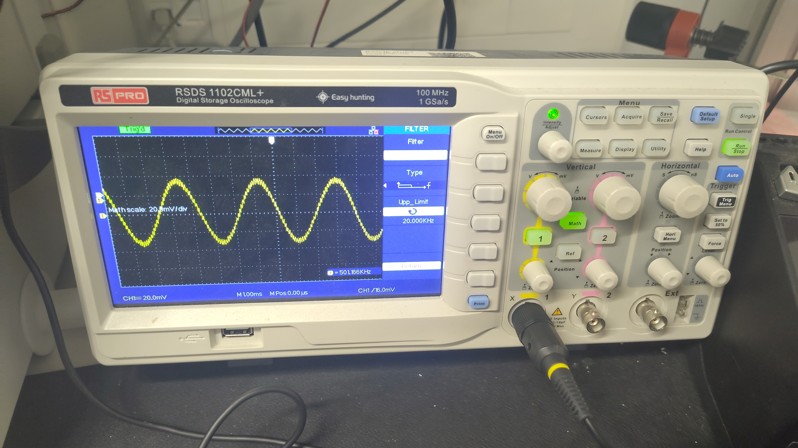
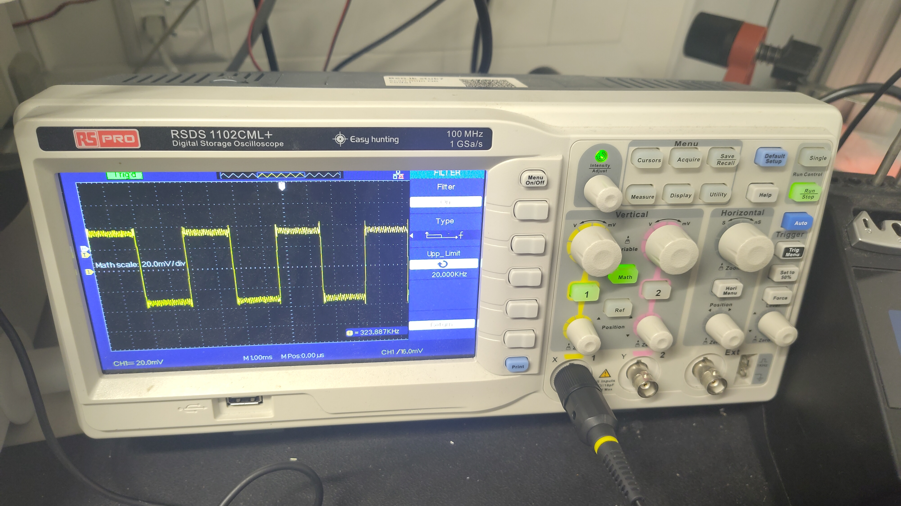
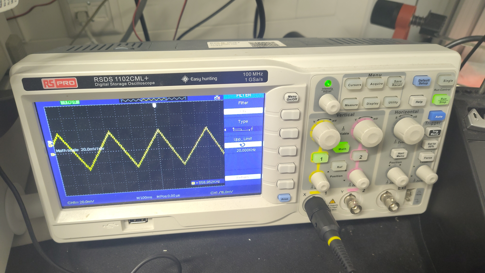

# Micro Processor Subsystem
To achieve the functionalities that the micro processor needs to fulfill, a number of features that the micro processor has need to be assessed. The following features must be accessed/computed using software on the micro processor:

- UART Communication
- Sample Generation & Waveform Manipulation
- Audio Output
- GPIO Control
- Communication to python
- Multithreading

From these features a program can be built into an application that runs at boot on the micro processor. With this program running the functionality is tested, while also testing if the requirements of the whole device are met.

## Theory
As a result of the required features of the microprocessor and the choice of the Raspberry Pi 4B (RPi), the more specific implementation can be explored. The exploration of the features on the RPi lends the ability to achieve the functionalities. 

### Software
To run the required software some installations are needed. With a preference for low compute time and availability of all features in the software, `C++` is chosen as the main language for the signal processing part on the RPi.

#### Operating System
First of all, a Raspberry Pi runs an operating system (OS). This OS allows for control of all systems on the RPi. On purchase the RPi requires an SD card with a flash of the latest version of [Raspberry Pi OS](https://www.raspberrypi.com/software/operating-systems/). From there the RPi can be accessed by its HDMI and USB ports and powered using a USB C.

#### Installing Dependencies
With access to the RPi shell, all dependencies and files can be installed. Using the following bash commands, the `<library name>` can be installed.

Always making sure to have the latest software.
```bash
sudo apt upgrade
```

Installing C/C++ libraries
```bash
sudo apt install <library name>
```

Installing python libraries
```bash
sudo apt install python3-<library name>
```

A list of dependencies for this project is listed in []().

#### Automatic Execution
For the purpose of this project, a plug and play implementation is required. As the RPi is usually operated using a keyboard, mouse and screen this is not the default case for programs that are on the RPi. The RPi can execute programs at boot and at login. At boot the program has access to all systems on the board itself, including the audio system, GPIO pins and internal hardwired ip-addresses. At login the systems that are connected to the RPi become available, including a display. The method to run files at boot is listed in detail [here](https://www.thedigitalpictureframe.com/ultimate-guide-systemd-autostart-scripts-raspberry-pi/).

### Communication UART
For the RPi, no extra library needs to be installed to be able to access the serial port. `termios` and `fcntl` are pre installed libraries, which access the serial port and can initialize the port with certain settings such as Baud rate, input/output mode. The following scheme is sketched in the wiki on Termios: @noauthor_serial_nodate

1. Open serial device.

1. Configure communication parameters.

1. Use standard Unix system calls read and write.

1. Close serial device.

The device name of the UART ports on the GPIO pins is `"/dev/ttyS0"`.

The communication parameters: `options.c_cflag`, `options.c_lflag`, `options.c_oflag` and `options.c_iflag`, or control, local, output and input flags. These parameters can be altered for the desired communication form. For simplicity a common implementation is best, where the Baud rate is 115200, readmode is activated and forcing 8-bit mode for ASCII character transmission. The opening and configuration and reading of the serial port is shown in [](#code-UART). The program includes an implementation of reading single characters and adding them to a buffer until a `"\n"` is received.

```{code}c++
:label: code-UART
:caption: Implementation of the termios library to access the serail port of the RPi.

int uart0_filestream = -1;

struct termios options;

void set_interface_attribs(void)
{
    //Open uart
    uart0_filestream = open("/dev/ttyS0", O_RDWR | O_NOCTTY);		//Open in non blocking read/write mode
    if (uart0_filestream == -1) {
        //ERROR - CAN'T OPEN SERIAL PORT
        printf("Error: Unable to open UART\n");
    }

    //Configure uart
    
    tcgetattr(uart0_filestream, &options);

    cfsetispeed(&options, B115200);
    cfsetospeed(&options, B115200);

    options.c_cflag |= (CLOCAL | CREAD);
    options.c_cflag &= ~PARENB;
    options.c_cflag &= ~CSTOPB;
    options.c_cflag &= ~CSIZE;
    options.c_cflag |= CS8;

    options.c_lflag = 0;
    options.c_oflag = 0;
    options.c_iflag = IGNPAR;

    options.c_cc[VMIN]  = 1;
    options.c_cc[VTIME] = 1;

    tcsetattr(uart0_filestream, TCSANOW, &options);
}

bool read_line(int fd, char* buffer, size_t maxlen)
{
    size_t idx = 0;

    while (idx < maxlen - 1)
    {
        char c;

        // read serial character
        int n = read(fd, &c, 1);

        if (n > 0)
        {
            // newline reached
            if (c == '\n')
            {
                break;
            }

            // ignore carriage return
            if (c != '\r')
            {
                buffer[idx++] = c;
            }
        }
    }

    buffer[idx] = '\0';

    return idx > 0;
}

void parameter_aquisition(void)
{
    while(true){
        //----- CHECK FOR ANY RX BYTES -----
        if (uart0_filestream != -1)
        {
            char line[128];

            if(read_line(uart0_filestream, line, sizeof(line)))
            {
                printf("RX = [%s]\n", line);
            }
        }
    }
}

int main(void)
{
    set_interface_attribs();
    parameter_aquisition();
}
```

### Sample Generation & Waveform Manipulation
To generate audio of a certain form batches of samples need to be generated before being sent in buffers to an audio device. Two different methods are considered for this, where one is a lookup table made beforehand and the other uses functions calculating the samples' magnitude on the fly. The lookup table works quite well in specific situations, however, the accuracy in output frequency is determined by the number of samples in this lookup table. This is not the case for function based sample generation and the execution time difference is not noteworthy.

(subsubsec-phase)=
#### Continuous Phase
The batches of samples generated need to fit together and should not have jumps if the waveform is continuous. To omit this a relative phase variable is used to keep track of the step instead of beginning at zero at each new buffer generation. This phase is kept between $0$ and $2\pi$, by subtracting $2\pi$ when it is exceeded. Each phase step is then additively variated by adding the time between samples to the phase like in [](#phase adding). Here $\phi(i)$ is the phase, $f$ is the current frequency and $f_s$ the sampling frequency.

```{math}
:label: eq-phase-adding

\phi(i) = \phi(i-1) + \frac{2\pi f}{f_s}
```

#### Functions
The following functions are used to generate the Sine, Block and Triangle wave. In the equations below the $A$ represents the amplitude sent from the micro controller and $\phi(i)$ represents the current phase.

1. Sine
C++ has a library, `<math.h>`, that has a sin function built in, so the function becomes:
```{math}
:label: eq-sin-gen

\text{buffer}[i] = 2^{\text{\#DAC bits}-1} \cdot A \sin(\phi(i))
```

2. Block
For the block wave the output should be the minimum for half the phase and maximum for the other half so the function becomes:

```{math}
:label: eq-block-gen

\text{buffer}[i] = 
\begin{cases}
    -2^{\text{\#DAC bits}-1} \cdot A & \quad \phi \leq \pi\\ 
    2^{\text{\#DAC bits}-1} \cdot A & \quad \phi > \pi
\end{cases}
```

3. Triangle
For the triangle wave, the output should ramp up for half the phase from minimal to maximal amplitude and ramp down for the other half from maximum back to minimum, so the function becomes

```{math}
:label: eq-triangle-gen

\text{buffer}[i] = 
\begin{cases}
    2^{\text{\#DAC bits}-1} \cdot A (\frac{2\phi(i)}{\pi}-1) & \quad \phi \leq \pi\\ 
    2^{\text{\#DAC bits}-1} \cdot A (\frac{2(\pi-\phi(i))}{\pi}+1) & \quad \phi > \pi
\end{cases}
```


### Audio Output
For accessing the audio output of the RPi in C/C++, the ALSA sound library API is used. This can access the output devices and send samples to the 3.5mm jack. @noauthor_alsa_nodate To use the alsa library the API should be installed.
```bash
sudo apt install alsa-utils libasound2-dev alsa-tools
```
For compilation and building your C/C++ files, append the -lasound to your compile and build commands.

The RPi does not have a DAC on-board, instead it uses pulse width modulation (PWM) to generate audio signals. This technique uses the duty cycle of the PWM signal to control the output voltage. For high voltages a duty cycle close to 100% is used, voltages close to zero hang at 50% and low voltages close to 0%. The resulting signal then contains very high frequencies on top of the desired signal frequencies. @https://www.analog.com/media/en/analog-dialogue/volume-40/number-2/articles/class-d-audio-amplifiers.pdf The RPi filters much of the undesired frequency band with an RC filter. @https://forums.raspberrypi.com/viewtopic.php?t=8684 The resulting audio is not great, however, the quality of the simple waveforms that are generated is high enough using this method.

The API requires the definition of some parameters. These parameters include the format, access, number of channels, sample rate, soft_resample and latency. The latency determines how much latency is allowed for samples to be sent, otherwise the software underruns. An implementation of initializing the audio output and setting the parameters is given below.

```c++
// Audio
int err;
snd_pcm_t *handle;
// Open and configure the playback device
err = snd_pcm_open(&handle, "hw:CARD=Headphones", SND_PCM_STREAM_PLAYBACK, 0);
if (err < 0) {
    fprintf(stderr, "Playback open error: %s\n", snd_strerror(err));
    return EXIT_FAILURE;
}

err = snd_pcm_set_params(handle,
                            SND_PCM_FORMAT_S16_LE,
                            SND_PCM_ACCESS_RW_INTERLEAVED,
                            1, SAMPLE_RATE, 1, 40000);
if (err < 0) {
    fprintf(stderr, "Hardware configuration error: %s\n", snd_strerror(err));
    snd_pcm_close(handle);
    return EXIT_FAILURE;
}
```

Frames can then be sent using the following `C++` code.
```c++
// Send frames to ALSA pipeline
snd_pcm_sframes_t frames = snd_pcm_writei(handle, buffer, BUFFER_SIZE);
if (frames < 0) {
    frames = snd_pcm_recover(handle, frames, 0);
}
if (frames < 0) {
    fprintf(stderr, "snd_pcm_writei failed: %s\n", snd_strerror(frames));
    break;
}
```

#### Sample Rate

According to the subsystem requirements, the base tones of the audio that is to be generated reach to approximately 3000Hz. According to the Nyquist condition ($f_s\geq 2B$), sampling should be done at at least twice this frequency. However, keeping in mind the sine, block and triangle forms, only the block waveform can be reliably and recognisably generated. Additionally, for modularity for future improvements, different audio waveforms may be used, such as, more complex instrument recordings. For this reason it was chosen to look at sampling rates common in audio systems. Due to the audible hearing limit lying at 20kHz, a sampling frequency of at least 40kHz is needed, including a margin to omit sampling only nodes. This is the reason many audio signals are sampled at 44.1kHz (CDs for example). Currently higher sampling rates are used as well, below in [](#tab-sound) the different purposes for different sampling rates in audio are laid out. @noauthor_audio_2024

:::{table}
:label: tab-sound
:align: center
| Sample rate   | Use case  |
| :---          | :---      |
| 44.1kHz       | Standard for music CDs |
| 48kHz         | Standard for audio in film and video |
| 96kHz and 192kHz | High quality audio production |

Different sampling rate use cases in digital audio processing.
:::
The ALSA library has a default setting of 48kHz and will resample audio of a different rate. @noauthor_alsa_nodate In the end, it is chosen to keep the sampling rate at 48kHz, so that no extra configuration is needed and more complex audio fragments can be used in future implementations.

#### Buffer Size


### GPIO Control
The general purpose input and output pins of the RPi can be accessed using a daemon, for access to this daemon the following library needs to be installed.

```bash
sudo apt install libgpio-dev
```

Which gives access to the `<gpiod.h>` library. With some inspiration from the example codes in @noauthor_libgpiodexamplestoggle_line_valuec_nodate, an implementation of this library is made in C++ and can be seen in [](#code-gpiod). Here pointers to the GPIO board and line request are made to access multiple pins. The lines are configured to output mode, the pin numbers are also set in the form of offsets and then attached to the request. Each pin can then individually be set to `HIGH` or `LOW` using `gpio_line_request_set_value(gpio_request, gpio_offsets[i], <value>);`. The pins' output values control a two muxes that both have 16 output pins. Four pins drive which output of both the muxes is selected and the other two are connected to the enable pin of the muxes and are inversely coupled. The code also already includes a translator from `int` to `bit` representation of a value, so that 6 pins' output mode can be inputted using a value from 0 to 31. As the LEDs are laid out in a line, the input 0 should turn on the left most LED and 31 the right most.

```{code} c++
:label: code-gpiod 
:caption: GPIO library 

#include <gpiod.h>
#include <unistd.h>
#include <stdlib.h>

#define S0 17
#define S1 27
#define S2 22
#define S3 23
#define E0 25
#define E1 24

// GPIO chip and request for libgpiod v2.x
struct gpiod_chip *gpiod_chip_handle = NULL;
struct gpiod_line_request *gpio_request = NULL;
unsigned int gpio_offsets[6] = {S0, S1, S2, S3, E0, E1};

void init_gpio(void)
{
    // Open the GPIO chip (typically /dev/gpiochip0 on Raspberry Pi)
    gpiod_chip_handle = gpiod_chip_open("/dev/gpiochip0");
    if (!gpiod_chip_handle) {
        perror("gpiod_chip_open");
        exit(1);
    }

    // Create line configuration for all pins as outputs
    struct gpiod_line_config *line_cfg = gpiod_line_config_new();
    if (!line_cfg) {
        perror("gpiod_line_config_new");
        gpiod_chip_close(gpiod_chip_handle);
        exit(1);
    }

    struct gpiod_line_settings *settings = gpiod_line_settings_new();
    if (!settings) {
        perror("gpiod_line_settings_new");
        gpiod_line_config_free(line_cfg);
        gpiod_chip_close(gpiod_chip_handle);
        exit(1);
    }

    // Configure settings as output
    gpiod_line_settings_set_direction(settings, GPIOD_LINE_DIRECTION_OUTPUT);
    // gpiod_line_settings_set_output_value(settings, GPIOD_LINE_VALUE_ACTIVE);

    // Add all pins with these settings
    if (gpiod_line_config_add_line_settings(line_cfg, gpio_offsets, 6, settings) < 0) {
        perror("gpiod_line_config_add_line_settings");
        gpiod_line_settings_free(settings);
        gpiod_line_config_free(line_cfg);
        gpiod_chip_close(gpiod_chip_handle);
        exit(1);
    }

    // Create request config
    struct gpiod_request_config *req_cfg = gpiod_request_config_new();
    if (!req_cfg) {
        perror("gpiod_request_config_new");
        gpiod_line_settings_free(settings);
        gpiod_line_config_free(line_cfg);
        gpiod_chip_close(gpiod_chip_handle);
        exit(1);
    }

    gpiod_request_config_set_consumer(req_cfg, "wave_generation");

    // Request the lines
    gpio_request = gpiod_chip_request_lines(gpiod_chip_handle, req_cfg, line_cfg);
    if (!gpio_request) {
        perror("gpiod_chip_request_lines");
        gpiod_request_config_free(req_cfg);
        gpiod_line_settings_free(settings);
        gpiod_line_config_free(line_cfg);
        gpiod_chip_close(gpiod_chip_handle);
        exit(1);
    }

    // Clean up temporary configs
    gpiod_request_config_free(req_cfg);
    gpiod_line_settings_free(settings);
    gpiod_line_config_free(line_cfg);
}

void cleanup_gpio(void)
{
    // Release the line request
    if (gpio_request) {
        gpiod_line_request_release(gpio_request);
    }

    // Close the chip
    if (gpiod_chip_handle) {
        gpiod_chip_close(gpiod_chip_handle);
    }
}

void drive_leds(void)
{
    uint8_t value = 0;
    int i;
    float f;
    enum gpiod_line_value array[5];

    while(true) {
        value = 10; //obtain the value from some other variable
        if (value < 0) {
            value = 0;
        } else if (value > 32) {
            value = 32;
        }

        for (i = 0; i < 5; i++) {
            array[i] = static_cast<enum gpiod_line_value>((value >> i) & 1);
        }
        
        // Write values using libgpiod v2.x API
        gpiod_line_request_set_value(gpio_request, gpio_offsets[0], array[0]);  // S0
        gpiod_line_request_set_value(gpio_request, gpio_offsets[1], array[1]);  // S1
        gpiod_line_request_set_value(gpio_request, gpio_offsets[2], array[2]);  // S2
        gpiod_line_request_set_value(gpio_request, gpio_offsets[3], array[3]);  // S3
        gpiod_line_request_set_value(gpio_request, gpio_offsets[4], array[4]);  // E0
        gpiod_line_request_set_value(gpio_request, gpio_offsets[5], static_cast<enum gpiod_line_value>(~array[4])); // E1 (inverted)

        std::this_thread::sleep_for(std::chrono::milliseconds(10));
    }
}

int main(void)
{
    init_gpio();
    drive_leds();
}
```

### Communication Visualisation
For communication between the `C++` program that runs the audio generation and the `python` program that runs the visualisation, a few different options can be used. Two prominent options feature either embedded memory sharing, which is very difficult to implement and using a socket to share data via the internal network of the RPi. The latter option is chosen as its use is well documented and easy to implement. The `<socket.h>` library should be included and with this the local network can be accessed and data can be sent. In this case the whole buffer that also gets sent to the audio output, gets sent to the `python` program, in addition to the display setting that passed from the ESP through the `C++` program to the `python` program.

```{code}
WIP
```

### Multithreading
WIP

## Method
With the explored features the required functionalities can be achieved. The verification of these functionalities is done in this section.

### Implementation
To integrate all the features on the RPi in a single executable, the structure illustrated in the Nassi-Shneiderman diagram in [](#fig-nassi-shneider-rpi) is implemented in `C++`.

```{figure} figures/11.SP_RPI/Nassi-Shneiderman-rpi.png
:label: fig-nassi-shneider-rpi

A Nassi Shneiderman diagram illustrating the program running on the RPi.
```

The full code for this implementation is given in [](#code-rpi-full).

```{code}
:label: code-rpi-full
:caption: The full integration of all required features of the RPi.

WIP
```

### Verification
To test the functionalities listed in the [SP overview](#chapter-sp-overview) and establish that all [relevant requirements](#sec-PoR) are met, the functionality of [](#code-code-rpi-full) must be verified. 

#### Receiving Settings
The relevant requirement from the [program of requirements](#sec-PoR) is:
- Each parameter must be independently adjustable (e.g., separate controls for pitch and volume).

The settings are transmitted from the ESP to the RPi using UART. To verify accurate data is received, a `printf()` statement is used to print what `string` is received. During execution the output stream should show the numerically represented settings separated by commas.


#### Waveform Generation, Waveform Manipulation and Audio Generation
The relevant requirements from the [program of requirements](#sec-PoR) are:
- The device must enable students to observe and manipulate clearly distinguishable frequencies across at least 4 octaves.
- The device must enable students to observe and manipulate at least 3 noticeable volume levels.
- The device must enable students to observe and manipulate at least 3 distinct overtones.

Following the structure illustrated in [](#fig-nassi-shneider-rpi), the RPi creates a buffer that contains samples for three different types of waves depending on the settings updated by the UART loop. Then the buffer is passed through the PWM sound generation to the 3.5mm jack. To verify that this happens, an oscilloscope is connected to measure the output of the 3.5mm jack, see [](#fig-meas-probe). The amplitude, frequency and waveform changes then establish if the requirements are met. On the oscilloscope a low pass filter is applied to band limit the output signal and make the audible part of the PWM signal more visible.

```{figure} figures/11.SP_RPI/Measuring_setup_waveform.jpg
:label: fig-meas-probe

Measuring setup waveform, generation, manipulation and audio generation.
```

#### Playing Guide
The relevant requirement from the [program of requirements](#sec-PoR) is:
- Users should be able to play the device without any musical or technical experience.

To make playing the device accessible, a playing guide is implemented, to map what frequencies need to be played to a hand position. For the purpose and extent of this project, the verification of this requirement a backwards implementation is used. Instead of mapping predetermined frequency to a hand position, the currently played hand position gives the frequency and the LED at that position must turn on. Because the frequency is calibrated between two frequencies according to [](#eq-note_to_freq), the mapping from a 4 octave system is remapped to a 32 "note" representation of the same graph. These "notes" are referred to as the on LED and is calculated using [](#eq-freq-to-val).

```{math}
:label: eq-freq-to-val

\text{LED}_\text{ON} = 31 - \text{round}(8log_2(f/f_0))
```

To verify that the LED array displays the right LED at the right frequency a frequency sweep must be done to see if the LEDs each turn on consecutively after each neighboring LED. The circuit of the LED array is described in [](#sec-playing-guide).

#### Not tied to a function: Latency
The relevant requirements from the [program of requirements](#sec-PoR) are
- The device must provide real-time feedback (audio and visual).
- Input-to-sound latency must be < 30 ms (feels instantaneous).

To see the delays and cycle time of the program, the time each function takes is measured using the `std::chrono::high_resolution_clock::now()` method by subtracting the start time from the end time.

#### Not tied to a function: Startup
The relevant requirement from the [program of requirements](#sec-PoR) is:
- The device must be ready to use within ≤ 1 minute of turning on the device.

The RPi has a boot sequence. The time between power up and ready to use is measured using a simple stopwatch.


## Results

### Receiving Settings
### Waveform Generation, Waveform Manipulation and Audio Generation
```{figure}
:label: fig-waveforms





Waveforms after buffer and audio generation and filtering with slight modulation noise.
```
### Playing Guide
### Not tied to a function: Latency
### Not tied to a function: Startup

```{figure}
:label:


```

## Discussion
- The device must enable students to observe and manipulate clearly distinguishable frequencies across at least 4 octaves.
- The device must enable students to observe and manipulate at least 3 noticeable volume levels.
- The device must enable students to observe and manipulate at least 3 distinct overtones.

- Each parameter must be independently adjustable (e.g., separate controls for pitch and volume).
- The device must provide real-time feedback (audio and visual).
- Input-to-sound latency must be < 30 ms (feels instantaneous).

- The device must be ready to use within ≤ 1 minute of turning on the device.