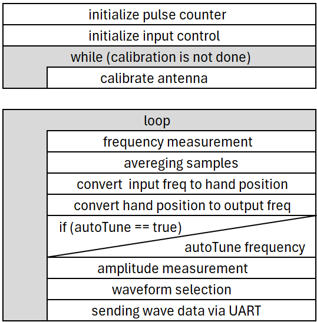

# Microcontroller Subsystem

## Introduction
As discussed in the previous chapter, the microcontroller should mainly function as an input controller. It will receive the following inputs:

1. **Sensor oscillations:** Your hand forms a variable capacitor with an antenna. This variable capacitor will be part of an oscillator, which oscillates around 900 kHz. The frequency of the oscillator will give you information on the position of the hand.  
2. **calibration button:** The capacitance of the variable capacitor is dependent on the surroundings of the theremin. Therefore the theremin should be calibrated whenever it is put inside a new environment. This is done by putting you hand on multiple known positions and than pressing a button to record the oscillations at this position. 
3. **AutoTune switch:** The theremin will accommodate an AutoTune function, which will make it easier to play. A switch is used to enable this functionality. 
4. **Amplitude slider:** The amplitude of the sound will be determined by a slider. 
5. **Waveform selection switch:** The theremin will be able to play multiple waveforms. A 3-way switch is used to select between a sine, a triangle and a block wave. 

The microcontroller will process all of these inputs and will send the the amplitude, frequency and waveform-type (square, sine or triangle) to the microprocessor. The connection between the processor and the controller will be done using an UART protocol. 

Furthermore the microcontroller will also be used to calibrate the system and to autoTune the played notes. 


## Theory 

### Choosing a Microcontroller 

To accommodate all of these functions, the right microcontroller should be chosen. Since there are a lot of microcontrollers to chose from, three candidates were chosen for further evaluation to keep the selection process manageable and maintain project progress. The Arduino Uno an ESP32 Wroom and a Teensy 4.0 were all considered. The specifications of each controller can be seen in the table below ({numref}`micro_table`).

```{table} comparing the specifications of the different microcontrollers with each other.
:name: micro_table

| Spec              | Arduino Uno | ESP32 Wroom | Teensy 4.0 |
|-------------------|:------------:|:------------:|:------------:|
| Price             | €30         | €25         | €30         |
| Clock             | 16 MHz      | 240 MHz     | 600 MHz     |
| Flash Memory      | 32 kB       | 4 MB        | 2 MB        |
| Operating Voltage | 5 V         | 3.3 V       | 3.3 V       |
| Digital Pins      | 14          | 30          | 40          |
| Analog Inputs     | 6           | 18          | 14          |
| ADC               | 10 bit      | 12 bit      | 12 bit      |
| DAC               | 12 bit      | 8 bit       | – (use audio adaptor) |
| Sampling Frequency| ~50 kHz     | 200 kHz     | >1 MHz      |
| Pulse counter     | yes         | yes         | no          |
```
*Source: {cite}`comparing_microcontrollers`.*


The Arduino Uno does not have a enough memory to accommodate for large pieces of code and it also does not have a lot of input pins. Therefore we will not use an Arduino

Both the ESP32 and the Teensy have enough input pins to accommodate for all our features. The Teensy is useful for real time audio processing because of its fast clock rate and high sample frequency. However for our applications the ESP32 will also do fine. It was therefore decided to use an ESP32, because we already had one lying around to test with.


### frequency scaling
The goal of the theremin is to convert the position of a hand relative to the antenna into an audible sound. The hand position is first translated into an oscillation frequency by a capacitive oscillator circuit. A microcontroller then maps this oscillator frequency to a frequency within the audible range. Since the relationship between hand position and oscillator frequency is non-linear, the conversion cannot be performed using a simple linear scaling. Furthermore, the output frequency should follow a logarithmic response rather than a linear one, as human pitch perception is logarithmic in nature.

The relation between the oscillator and the hand position depends on two things. Firstly it depends on the relation between the hand position and capacitance. It is difficult to accurately determine this relationship, since the you are looking for the capacitance between a metal rot (the antenna) and a linear plate (hand). For our case we will approximate this relation with the formula for capacitance of two parallel plates. Secondly, the frequency also depends on the oscillator circuit. For this we use the frequency relation of a Colpitts oscillator. 

The formula for a parallel plate capacitor can be seen below:
$$
C = C_0 + \frac{\epsilon _0  A}{d}
$$

where:
- **C** = total capacitance [F]

- **C₀** = background capacitance [F]

- **ε₀** = vacuum permittivity ($8.854 \times 10^{-12} F/m$)

- **A** = plate area [m²]

- **d** = plate separation [m]


The frequency of a Colpitts oscillator can be seen in the formula below:

$$
f = \frac{1}{2\pi \sqrt{LC}}
$$

where:
- **f** = frequency of oscillator [Hz]
- **L** = inductance in oscillator [H]
- **C** = total capacitance [F] 

by combining these two formulas and you will get:

$$
f = \frac{1}{2\pi \sqrt{L (C_0 + \frac{\epsilon _0  A}{d})}}
$$

$$
f = \frac{1}{2\pi \sqrt{LC_0}} \times \frac{1}{\sqrt{1+\frac{\epsilon _0 A}{d C_0}}}
$$

$$
f = \frac{A}{\sqrt{1+\frac{B}{d}}}
$$

where:
- **f** = frequency of oscillator [Hz]
- **A** = constant related to the maximum frequency
- **B** = constant related to the relative hand-capacitance strength
- **d** = distance of the hand [m] 


If we assume that everything except distance stays constant, there are only two value's which should be optimized to find a good fit for the relation between distance and frequency. The hand distance can be found by inverting the formula above. 

To map the hand distance to the right frequencies it is important to know the science behind music. Music is composed of octaves which are made from notes. Each octave contains 12 notes and each octave is exactly twice as high as the previous octave. By representing each note as a number you can find the following relation:

$$
f = f_0 \cdot 2^{\frac{n}{12}}
$$

where:
- **f** is the output frequency [Hz]
- **f₀** is the lowest frequency of the theremin [Hz]
- **n** is the note that is being played.

This formula can be used to transform a linear range of notes to correct sounding musical frequencies. 

The table below shows the "correct" frequencies for each musical notes.

```{figure} figures/notes_to_freq.webp
:name: notes_to_freq

The frequencies of each note (rows) in each octave (columns).
```


## method  
A nassi schneiderman diagram of the code can be seen in the Figure below. In the setup face, the ESP32 starts with initializing the pulse counter and the input control. Then it will calibrate the system. In the loop face the ESP3 will continuously measure the input pulses, calculate the right output frequency, measure the amplitude and measure the wave form. The last step is to send all this data to the microprocessor using a UART connection.  




### Frequency measurement
The frequency measurements are performed using the ESP32's built-in pulse counter (PCNT) and timer. Every 20 ms, the timer expires and executes a callback function. This callback reads the pulse counter value and stops the counting process. After the measurement has been processed, the pulse counter is cleared and the timer is restarted to begin a new measurement. A physical wire between pin 32 and pin 35 is used to stop and enable the pulse counter.

The pulse counter unit uses a 16 bit signed register {cite}`datasheet_esp32`. This means that the largest number it can represent is +32767. When it reaches this number the counter resets. This is unwanted, therefore we give an interrupt at 25 000 pulses and then reset the counter. We can count the number of overflows and use that to keep track of the actual pulse count. This allows us to keep track of way higher numbers than the initial 16 bit register. 

The code that was used is based on the code for a precession frequency meter ({cite}`pulse_counter`).
 
### Calibration
The capacitance of the antenna depends not only on the user's hand, but also on the surroundings. It is therefore essential to first calibrate the antenna. 

### AutoTune
### "Simple" inputs


## results


## Discussion & conclusion